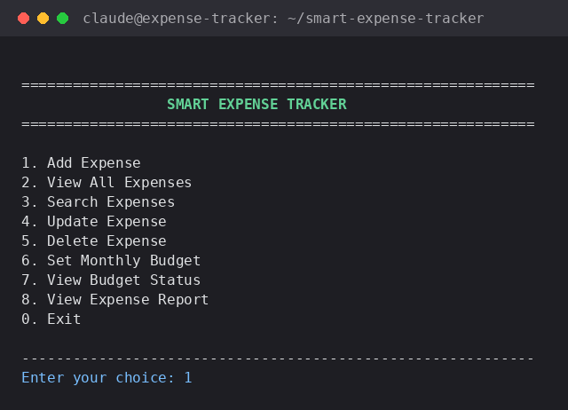
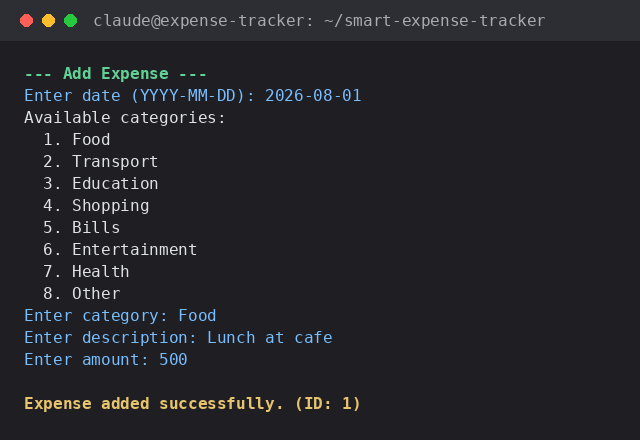
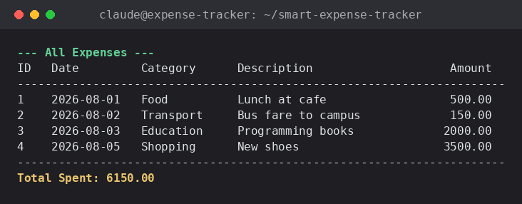
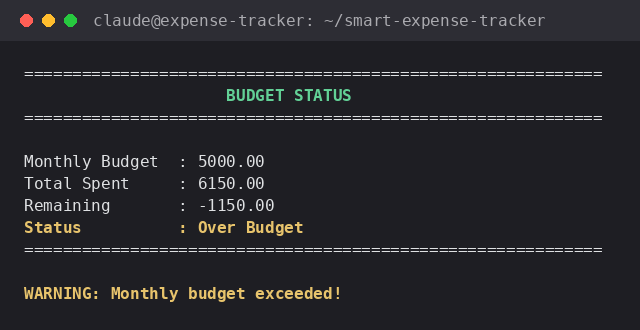
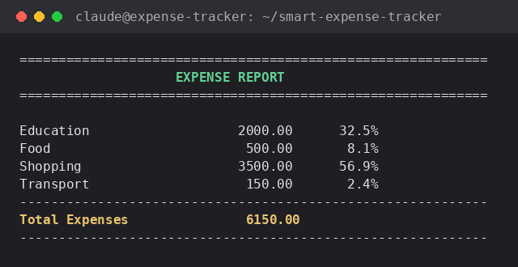

# 💰 Smart Expense Tracker

[](https://en.cppreference.com/w/cpp/17)
[](LICENSE)
[](#installation)
[](#technologies)

A professional, console-based personal finance manager written in modern **C++17**. Track expenses, set a monthly budget, and generate category-wise spending reports — all backed by simple, human-readable file storage so your data survives between sessions.

This project was built as a Computer Science portfolio piece, structured the way a small real-world C++ application would be: separate headers and implementation files, object-oriented design, and a clear split between data logic and the console interface.

---

## Table of Contents

- [Features](#features)
- [Screenshots](#screenshots)
- [Technologies](#technologies)
- [Project Structure](#project-structure)
- [Installation](#installation)
- [Compilation](#compilation)
- [Run](#run)
- [How to Use](#how-to-use)
- [Example Output](#example-output)
- [Making Changes](#making-changes)
- [Learning Objectives](#learning-objectives)
- [Future Improvements](#future-improvements)
- [License](#license)

---

## Features

- **Add Expense** — record a date, category, description, and amount with full input validation
- **View All Expenses** — a formatted table of every expense plus the running total
- **Search Expenses** — case-insensitive search across description, category, and date
- **Update Expense** — look up an expense by ID and edit any of its fields
- **Delete Expense** — remove an expense by ID with a confirmation prompt
- **Set Monthly Budget** — define how much you plan to spend in the current calendar month
- **View Budget Status** — see current-month spending, remaining budget, and a clear over/under-budget warning
- **Expense Report** — category-wise totals with each category's percentage of total spending
- **Data Persistence** — expenses and budget are automatically saved to disk and reloaded on startup
- **Robust Input Validation** — invalid menu choices, malformed dates, negative amounts, empty text, and unknown categories are rejected without crashing the program

## Screenshots

All screenshots below are taken from the actual compiled program — not mockups.

| Main Menu | Add Expense |
|---|---|
|  |  |

| View All Expenses | Budget Status |
|---|---|
|  |  |

**Expense Report**



More detail on each image: [`docs/screenshots/README.md`](docs/screenshots/README.md)

## Technologies

- C++17
- Object-Oriented Programming (classes, encapsulation, constructors, `const` correctness)
- Standard Template Library (`std::vector`, `std::map`, `std::array`)
- File I/O (`ifstream` / `ofstream`) and `<filesystem>`
- Make (simple, repeatable builds)
- Visual Studio Code

## Project Structure

```
smart-expense-tracker/
├── src/
│   ├── main.cpp             # Menu / user interaction only
│   ├── Expense.cpp          # Expense class implementation
│   ├── ExpenseManager.cpp   # Core data + file logic (add/search/update/delete/monthly budget)
│   └── Report.cpp           # Category-wise report generation
│
├── include/
│   ├── Expense.h
│   ├── ExpenseManager.h
│   └── Report.h
│
├── data/
│   ├── expenses.txt         # Auto-created; stores all saved expenses
│   └── budget.txt           # Auto-created; stores the current monthly budget
│
├── docs/
│   ├── WORKFLOW.md          # Day-to-day development workflow
│   └── screenshots/         # Real screenshots of the running app
│
├── Makefile
├── README.md
├── .gitignore
└── LICENSE
```

## Installation

**Requirements:** a C++17-capable compiler. On Windows, [MinGW-w64](https://www.mingw-w64.org/) (which provides `g++`) is recommended, along with [Visual Studio Code](https://code.visualstudio.com/).

1. Clone or download this repository.
2. Open the `smart-expense-tracker` folder in VS Code.
3. Make sure `g++` is on your PATH (`g++ --version` should work in a terminal).

## Compilation

**Option A — using `make` (recommended):**
```bash
make
```

**Option B — direct command (works everywhere, no `make` required):**
```bash
g++ -std=c++17 src/main.cpp src/Expense.cpp src/ExpenseManager.cpp src/Report.cpp -Iinclude -o expense_tracker
```

Both produce an executable named `expense_tracker` (`expense_tracker.exe` on Windows).

## Run

**Windows (cmd / PowerShell):**
```powershell
.\expense_tracker.exe
```

**Linux / macOS:**
```bash
./expense_tracker
```

Or, with `make`, build and run in one step:
```bash
make run
```

> Run the program from the project root so it can find (or create) the `data/` folder correctly.

## How to Use

| Option | Menu Item          | What it does                                                        |
|:------:|--------------------|----------------------------------------------------------------------|
| 1      | Add Expense        | Prompts for date, category, description, and amount, then saves it   |
| 2      | View All Expenses  | Prints every expense in a table with the total spent                 |
| 3      | Search Expenses    | Finds expenses matching a keyword in description, category, or date  |
| 4      | Update Expense     | Edits an existing expense by ID                                      |
| 5      | Delete Expense     | Removes an expense by ID after confirmation                          |
| 6      | Set Monthly Budget | Sets (or replaces) the current month's budget                        |
| 7      | View Budget Status | Shows budget, amount spent, remaining balance, and status             |
| 8      | View Expense Report| Shows a category-wise breakdown with percentages                     |
| 0      | Exit               | Closes the program (all data has already been saved automatically)   |

## Example Output

```
============================================================
                     BUDGET STATUS
============================================================

Monthly Budget  : 5000.00
Total Spent     : 6150.00
Remaining       : -1150.00
Status          : Over Budget
============================================================

WARNING: Monthly budget exceeded!
```

More examples are in the [Screenshots](#screenshots) section above.

## Making Changes

New to the project or picking it back up after a while? See
[`docs/WORKFLOW.md`](docs/WORKFLOW.md) for the simple edit → build → test →
commit loop used for every change, including example commit messages and a
pre-commit checklist.

## Learning Objectives

This project was built to practice and demonstrate:

- Structuring a C++ program into headers and implementation files (modular programming)
- Object-Oriented Programming: encapsulation, constructors, `const` correctness, and clean class design
- Using the STL (`std::vector`, `std::map`, `std::array`) to manage collections of objects
- Reading and writing structured data with file streams
- Writing defensive code that validates user input instead of crashing
- Separating concerns: `main.cpp` only handles menus, `ExpenseManager` only handles data, `Report` only handles reporting

## Future Improvements

- Graphical user interface (Qt or Dear ImGui)
- Replace flat-file storage with an SQLite database
- Visual charts for spending trends
- CSV export for expenses and reports
- Multi-user login system
- Income tracking alongside expenses
- Filtering reports by month/year
- Support for recurring expenses

## License

This project is licensed under the [MIT License](LICENSE).
